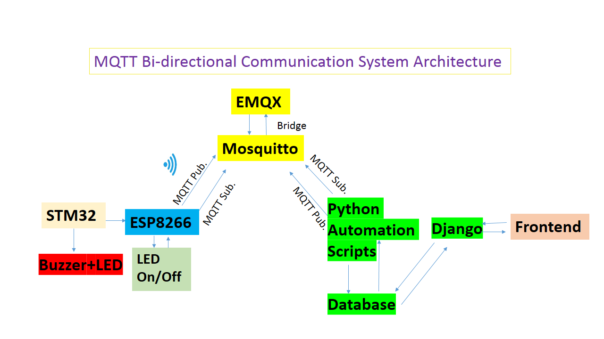
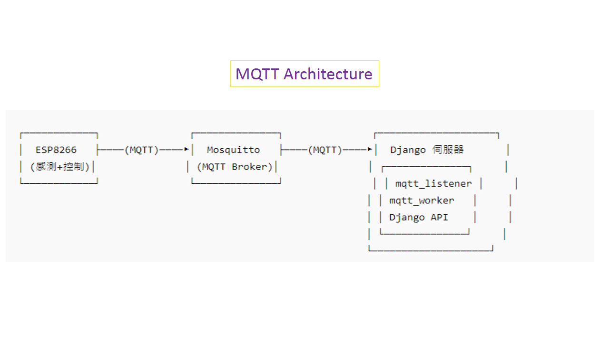
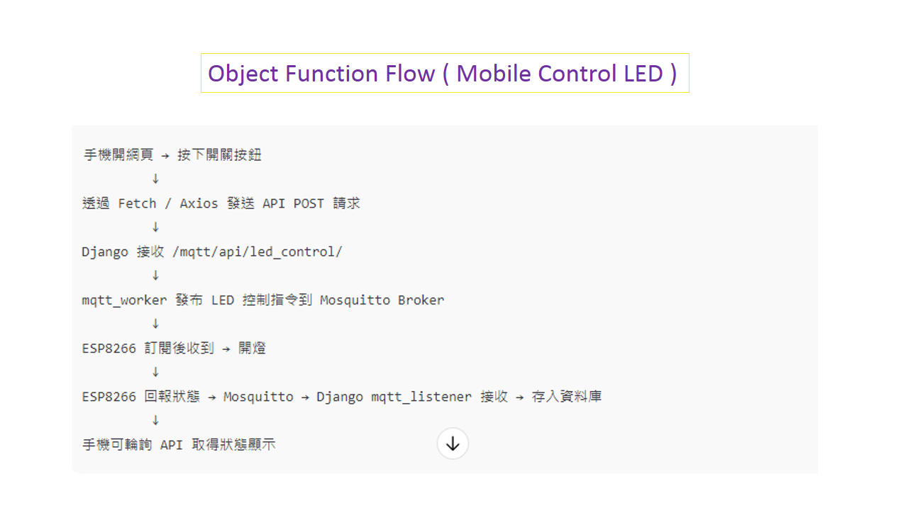

# 🌐 IoT Cloud Smart Monitoring System (MQTT × Django × Web) - V3

This project is a **full-stack IoT integration system** independently developed by me, 
integrating **STM32**, **ESP8266 boards**, **Mosquitto / EMQX MQTT Broker**,  
**Django backend server**, and **Web front-end (Desktop & Mobile)** 
to achieve **bi-directional control** and **sensor data collection, storage, and visualization**.

---

## 📌 Key Features｜系統特色
- **Real-time LED control and status feedback** (via MQTT)
- **Temperature & Humidity live display with historical charts** (Chart.js)
- **REST API × Django backend integration**
- **MySQL data storage and query**
- **JWT token authentication & secure control**
- **MQTT bi-directional bridging (Local Mosquitto ↔ Cloud EMQX)**
- Scalable to **multiple devices, multiple sensors, multiple control scenarios**

---

## 🧱 System Architecture｜系統架構圖
  
  

---

## 📌 Version Evolution｜系統版本演進

| Version | Feature | Description |
|---------|--------|-------------|
| **V1** | **Single-direction Web Server** | 單向資料傳送架構，APP僅能從伺服器讀取資料        |
| **V2** | **Dual-channel Sync** (Web + HTTP POST) | Added HTTP POST capabilities, 
                                                             introducing backend server |
| **V3** | **MQTT Bi-directional Communication** | Real-time two-way communication 
                                         between devices & server (Publish + Subscribe) |
| **V4** *(Planned)* | **MQTT + AWS IoT Core** | Device data uploaded to AWS IoT Core, 
                                     automatically stored in DynamoDB for global access |

---

## 🧭 System Architecture｜系統架構

**[STM32]**  
├─ Reads DHT22 sensor data  
└─ Publishes DHT22 data → ESP8266  

**[ESP8266]**  
├─ Publishes DHT22 data → Mosquitto  
├─ Subscribes to LED control ← Mosquitto  
└─ Sends LED status → Mosquitto  

**[Mosquitto Broker]**  
└─ Bridges MQTT → EMQX cloud broker  

**[Django Server]**  
├─ `/api/dht22_db/` → Query latest temperature & humidity  
├─ `/api/led_control/` → Control device  
├─ `/api/led_controlT/` → JWT-authenticated device control  
├─ `/api/show_dht22_db/` → Query last 100 sensor records  
└─ `/api/led_status/` → Query LED status  

**[Python Automation Scripts]**  
├─ `mqtt_worker_control.py` → Periodically check unexecuted control commands & publish to MQTT  
├─ `mqtt_listener_status.py` → Receive LED status feedback and store in DB  
└─ `mqtt_listener_dht22.py` → Receive temperature & humidity data and store in DB  

**[MySQL Database]**  
├─ Stores DHT22 temperature & humidity records  
├─ Stores device control commands  
└─ Stores device status  

**[Front-end (Browser / Mobile)]**  
├─ Query sensor data and render charts  
└─ Control LED and display feedback  

---

## 🔧 Technologies Used ｜技術使用

- **ESP8266**: Non-blocking programming, publish sensor data / receive control  
- **MQTT**: Mosquitto (local) & EMQX (cloud) bi-directional bridge  
- **Django + DRF**: REST API for data receiving & device control  
- **MySQL**: Secure storage, ORM access, historical queries  
- **Front-end**: HTML / CSS / JS / Chart.js / jQuery / Ajax / Fetch  
- **JWT**: Access/Refresh token flow and API permission control  

---

## 📚 Technical Highlights｜技術清單

| Technology | Demo / Showcase |
|------------|----------------|
| Python & Django | LED control API & database access |
| HTML / CSS | LED status & sensor table display |
| MQTT Protocol | MQTT topic publish / subscribe for LED control |
| Django REST Framework (DRF) | Serializer converts data to JSON, provides GET/POST APIs |
| Frontend-Backend Interaction | Ajax / Fetch for real-time LED & sensor chart updates |
| Database Operations | Query & sort latest N sensor records |
| MQTT & Django Integration | Backend subscribes MQTT topics and updates database |
| Token Authentication | JWT Access/Refresh token flow & API permission control |
| Project Architecture & Scalability | Modular Django apps, multi-device management |
| Error Handling & Debugging | 404 / 401 / 403 troubleshooting, MQTT disconnect handling |
| Product-level Integration | Sensor charts + LED control + Token authentication, optimized UI/UX |

---

## 🎯 Key Achievements｜成果亮點

✅ Industry-standard architecture  
✅ Bi-directional control data flow + device status feedback + environment data storage  
✅ Cloud bi-directional bridging architecture  
✅ Non-blocking ESP8266 programming  
✅ Backend subscription processing × API separation  
✅ Front-end periodic query & real-time display  
✅ JWT authentication & permission control  

---

## 📷 IoT V3 Screenshots & Photos ｜IoT V3 系統截圖與照片連結

### Hardware System
- [📷 Hardware System Photo](pics2/photo_HardwareSystem.JPG)

### API Test Screenshots
- [📷 GET DHT22 Data](pics2/Screenshot_api_get_DHT22data.JPG)  
- [📷 LED Control Panel](pics2/Screenshot_api_get_LedControlPanel.JPG)  
- [📷 LED Status](pics2/Screenshot_api_get_led_status.JPG)  

### Django & Front-end Display
- [📷 Historical Chart](pics2/Screenshot_historicalChart.JPG)  
- [📷 Data Card Display](pics2/Screenshot_displayCard.JPG)  
- [📷 Django Admin Screenshot](pics2/Screenshot_DjangoAdmin.JPG)  
- [📷 JWT LED Control](pics2/Screenshot_JWTledControl.JPG)  
- [📷 Login Page](pics2/Screenshot_login.JPG)  

### Front-end & JWT Token Demo
- [📷 IoT Webpage on Mobile](pics2/MobileSnagshot_IoTFrontendWebpage.JPG)  
- [📷 IoT JWT Token Demo on Mobile](pics2/MobileSnagshot_IoT_JWTTokenUSE_Webpage.JPG)  

---

## 🌟 IoT Application Scenarios｜產業應用場景

| Scenario | Description | Benefit |
|----------|------------|---------|
| Smart Factory Equipment Monitoring | STM32 / ESP8266 read device temperature/humidity & status, real-time LED/alert control | Reduce downtime risk, enable remote monitoring |
| Smart Agriculture / Greenhouse | DHT22 sensor measures environment, controls fan, irrigation, lights | Automated environment control, improve yield & quality |
| Warehouse Monitoring | Monitor warehouse temperature/humidity, auto alert on abnormal | Prevent product damage, reduce manual inspection cost |
| Smart Office / Home Automation | Control lights, AC, appliance switches with real-time front-end | Energy saving, improve comfort |
| Remote Equipment Maintenance | Control devices via MQTT and report execution status | Save manpower, reduce field trips |
| Cold Chain Logistics | Monitor vehicle temperature/humidity for fresh food/medicine | Ensure compliance with safety standards |
| Smart Classroom / Public Space | Sensor + control lights/fans, data analysis | Improve user experience, energy saving |
| Energy & Resource Management | Monitor electrical equipment & environment, auto control | Optimize energy & resource usage |
| Consumer Electronics | Integrate smart appliances, real-time control & feedback | Enhance user experience, smart living |
| Smart Building | Monitor/control lighting, HVAC, security & energy | Improve operational efficiency, reduce energy cost |

---

## 🧪 License | 授權條款

This project is for **personal IoT learning and portfolio purposes only**.  
本專案為個人學習與作品展示用途，未授權第三方轉載、教學、商業或競賽使用。

**License:**CC BY-NC-ND 4.0** 
Creative Commons Attribution-NonCommercial-NoDerivatives 4.0 International  
創用 CC「姓名標示－非商業性－禁止改作 4.0 國際」授權條款  

✅ 可瀏覽與參考技術流程  
❌ 不得轉載整段程式碼進行授課或出版  
❌ 不得修改為二創內容再發佈  
❌ 不得用於商業或競賽活動
